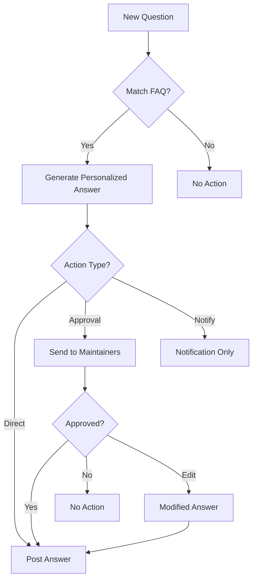

# FAQ Assistant - Open Source Community Helper

## Project Overview

The FAQ Assistant is an intelligent bot that monitors GitHub issues and chat platforms to automatically answer common questions by matching them with a curated FAQ database. This reduces maintainer workload and improves response times for contributors.

## Key Features

- **Multi-platform Support**: Works with both GitHub and Rocket.Chat
- **Smart Question Matching**: Uses AI to understand intent behind questions
- **Configurable Workflows**: Multiple response modes (direct answer, maintainer approval, notification)
- **Personalized Responses**: Tailors answers to specific questions rather than generic templates
- **Maintainer Oversight**: Approval system to ensure accuracy before posting

## Architecture

```
┌───────────────┐     ┌─────────────────┐     ┌────────────────┐
│   Platforms   │     │  FAQ Assistant  │     │ AI Integration │
│ (GitHub/Chat) │────▶│   Core System   │────▶│   (Gemini AI)  │
└───────────────┘     └─────────────────┘     └────────────────┘
                              │
                              ▼
┌───────────────┐     ┌─────────────────┐     ┌────────────────┐
│ Configuration │     │  Action Engine  │     │ User Interface │
│  & FAQ Store  │◀───▶│ (Response Flow) │────▶│  (Approvals)   │
└───────────────┘     └─────────────────┘     └────────────────┘
```

## Technical Stack

- **Backend**: Node.js with Express
- **AI Model**: Google Gemini 2.0
- **Data Storage**: JSON-based FAQ repository (expandable to databases)
- **Platforms**: GitHub API, Rocket.Chat API
- **Logging**: Winston for comprehensive activity tracking
- **Security**: Webhook signature verification, environment-based configuration

## Demo Workflow

### 1. Question Submission
A user posts a question on GitHub or Rocket.Chat that matches an existing FAQ.

### 2. Question Processing


### 3. Maintainer Approval Interface
Maintainers receive approval requests with options to:
- Approve and post as-is
- Reject the answer
- Edit and then approve
- Each action is logged for transparency

## Sample Results

### Example 1: Development Environment Setup
**Question**: "How do I set up the development environment for this project?"

**Matched FAQ**: "How do I set up the development environment?"

**Generated Response**:
```
Hi @user! To set up the development environment:

1. Clone the repo: `git clone https://github.com/org/repo.git`
2. Install dependencies: `npm install`
3. Copy `.env.example` to `.env` and configure your variables
4. Run the dev server: `npm run dev`

If you run into any issues, check the troubleshooting section in README.md or let me know!
```

### Example 2: Pull Request Workflow
**Question**: "I want to contribute. How to submit changes?"

**Matched FAQ**: "How do I submit a pull request?"

**Generated Response**:
```
Thanks for wanting to contribute @user! Here's how to submit your changes:

1. Fork the repo using the 'Fork' button
2. Clone your fork locally
3. Create a branch: `git checkout -b feature/your-feature`
4. Make changes and commit them
5. Push to your fork
6. Create a PR from our main repo
7. Fill out the PR template

Make sure your code follows our style guidelines and passes tests!
```

## Benefits & Impact

- **Faster Response Times**: Questions answered in seconds/minutes instead of hours/days
- **Reduced Maintainer Workload**: Common questions handled automatically
- **Consistent Information**: Ensures accurate and up-to-date information
- **Better Community Experience**: New contributors get help quickly
- **Data-Driven Improvements**: Identify common questions to improve documentation

## Future Enhancements

- Database integration for scalable FAQ storage
- Machine learning to improve matching over time
- User feedback collection on answer quality
- Automated FAQ suggestions based on recurring questions